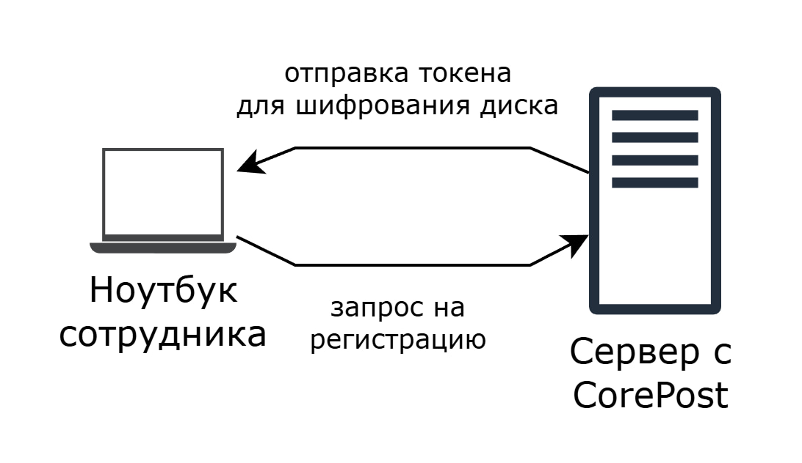
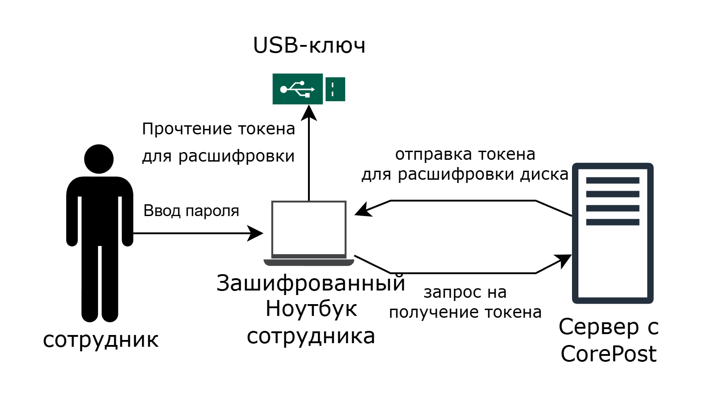
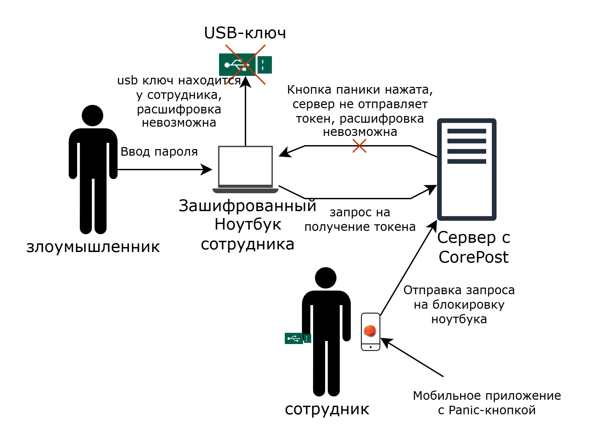

# CorePost

CorePost — модульная система предзагрузочной и посткомпрометационной защиты корпоративных устройств. Проект позволяет централизованно разрешать или запрещать расшифровку ноутбука до загрузки ОС и отзывать доверие к уже работающему устройству после инцидента.

## Что делает система

- переносит решение о допуске к данным на предзагрузочный этап;
- поддерживает профили 2FA и 3FA для расшифровки LUKS;
- даёт panic-lock через мобильный клиент;
- отзывает доверие к уже загруженному устройству через post-boot агент;
- работает локально, без привязки к внешним облачным сервисам.

## Наглядная схема

<figure>
  
  <figcaption>Регистрация устройства и получение параметров допуска.</figcaption>
</figure>

<figure>
  
  <figcaption>Штатная предзагрузочная расшифровка при наличии всех факторов.</figcaption>
</figure>

<figure>
  
  <figcaption>Отказ в расшифровке после блокировки или при неполном наборе факторов.</figcaption>
</figure>

## Архитектура

В CorePost есть четыре функциональных контура:

1. `corepost-server` хранит состояние устройств, секреты, политики и принимает решение о допуске.
2. `corepost-preboot` работает в ранней загрузке, поднимает сеть, запрашивает серверный токен и разрешает или запрещает расшифровку.
3. `corepost-agent` контролирует уже загруженную систему и выполняет post-boot политику отзыва доверия.
4. `corepost-mobile-android` и `corepost-mobile-ios` реализуют panic-клиент для аварийной блокировки.

Отдельно `corepost-install` отвечает за установку, первичную регистрацию устройства и раскладку конфигурации для preboot и agent.

## Репозитории

| Репозиторий | Назначение | Ссылка |
| --- | --- | --- |
| `CorePost` | корневой репозиторий проекта, архитектура, документация, demo flow | текущий репозиторий |
| `corepost-server` | FastAPI-сервер, API, хранение состояния, OpenAPI, docker compose | `../corepost-server` |
| `corepost-preboot` | предзагрузочный модуль допуска и интеграция с initramfs | `../corepost-preboot` |
| `corepost-agent` | post-boot агент для Linux, `systemd + curl`, политика реакции | `../corepost-agent` |
| `corepost-install` | установщик, регистрация устройства, генерация конфигов | `../corepost-install` |
| `corepost-mobile-android` | Android panic-клиент и релизный APK | `../corepost-mobile-android` |
| `corepost-mobile-ios` | iOS panic-клиент и релизный IPA | `../corepost-mobile-ios` |

## Сценарий работы

1. Администратор или установщик регистрирует устройство на сервере.
2. `corepost-install` получает `deviceId`, секреты и политику, затем подготавливает устройство.
3. При включении ноутбука `corepost-preboot` поднимает сеть и отправляет подписанный запрос на `corepost-server`.
4. Если устройство в состоянии `normal`, сервер подтверждает допуск и разрешает предзагрузочную расшифровку.
5. Если устройство переведено в `pending_lock` или `locked`, сервер отказывает в выдаче токена.
6. Если инцидент произошёл уже после загрузки ОС, `corepost-agent` получает команду на отзыв доверия и применяет политику: блокировка, завершение сессии или выключение.
7. После административного восстановления устройство можно вернуть в штатный контур.

## Модель состояний

Система использует следующую модель состояний устройства:

- `registered` — устройство создано в системе и готово к первичной привязке;
- `normal` — штатный режим, допуск к данным разрешён;
- `pending_lock` — двухшаговое подтверждение блокировки уже начато;
- `locked` — аварийный режим, допуск к данным запрещён;
- `restricted` — восстановление возможно только по дополнительной политике;
- `recovered` — устройство возвращено в рабочее состояние.

## Стенд и проверка

Для полноценной проверки проекта нужен локальный стенд из нескольких частей:

- `corepost-server` в Docker Compose;
- headless VM в QEMU с BIOS, GRUB, initramfs и Linux userspace;
- preboot-контур для проверки допуска до загрузки ОС;
- post-boot агент для сценария отзыва доверия;
- Android-эмулятор `emulator -avd my_avd` для мобильной демонстрации;
- Xcode для сборки и проверки iOS-клиента.

## Документация

- [Краткое визуальное описание сценариев](docs/visual-flow.md)
- `README.md` в компонентных репозиториях
- раздел `Releases` в мобильных репозиториях
